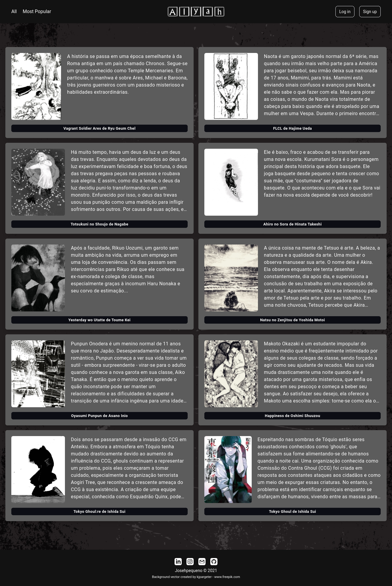

<p align="center">
<a href="https://github.com/Josehpequeno/Alyah"></a>
</p>
<p align="center">A manga manager where you can read, download and list your favorites.</p>
<p align="center">


</p>
<p align="center">
 <a href="#Heroku">Heroku</a> •
 <a href="#Preview">Preview</a> •
 <a href="#Prerequisites">Prerequisites</a> • 
 <a href="#Back-End">Back-End</a> •
 <a href="#Technology">Technology</a>  
<!-- 
 <a href="#contribuicao">Contribuição</a> • 
 <a href="#licenc-a">Licença</a> • 
 <a href="#autor">Autor</a>-->
</p>
<h4 align="center"> 
	:construction: Work In Progress. :construction:
</h4>

### Heroku

<a href="https://alyah.herokuapp.com/">:link: Heroku</a>

### Preview
Current situation of the homepage.



### Prerequisites
Before you begin, you will need to have the following tools installed on your machine:
[Git] (https://git-scm.com), [Node.js] (https://nodejs.org/en/).
In addition, it is good to have an editor to work with the code like [VSCode] (https://code.visualstudio.com/)

### Back-End

```bash
# Clone this repository
$ git clone https://github.com/Josehpequeno/Alyah.git

# Access the project folder in the cmd / terminal
$ cd Alyah

# Install the dependencies
$ npm install
# Run the application
$ npm run start
# Run the application in development mode
$ npm run dev
```

### Technology
- [Express](https://expressjs.com/)
- [Node.js](https://nodejs.org/en/)
- [Handlebars](https://handlebarsjs.com/)
- [Tailwindcss](https://tailwindcss.com/)
